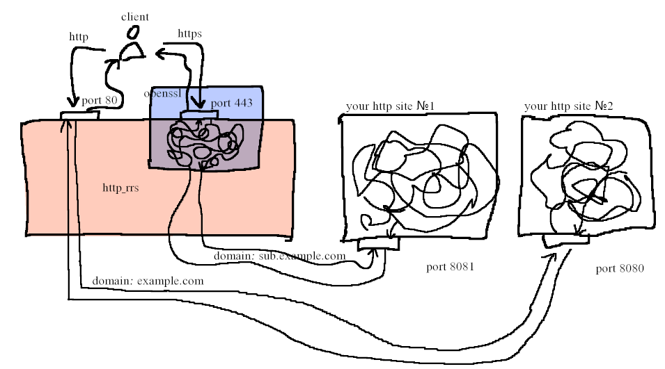

# HttpRRS
HTTP request redirection system

Default `conf.yml`:
```yml
http_host: localhost:80
https_host: localhost:443

sites:
  # - domain: example.com                            # Domain with SSL
  #   host: localhost:8080
  #   ssl_cert: "/path/to/public/certificate.txt"
  #   ssl_key: "/path/to/private/key.txt"

  # - domain: sub.example.com                        # Domain with no SSL
  #   host: localhost:8081

  - domain: localhost
    host: localhost:8080
```

## How it works

This works as a proxy that redirects based on the Host header\
This makes it possible to create several http servers on one hosting with one IP address, also using ssl encryption


